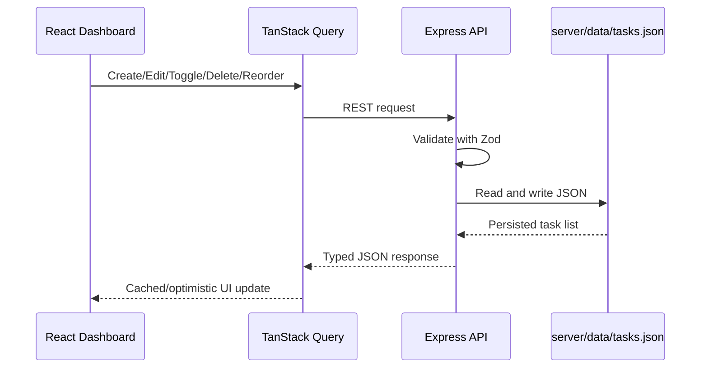

# Aurora Task Manager

Aurora Task Manager is a premium full-stack task management application built for the Personal Task Manager exercise. It pairs a dark-first, SaaS-style React dashboard with a clean Express REST API and JSON file persistence so tasks survive server restarts without requiring a database.

## Project Overview

This app goes beyond a basic todo list: it presents work as a polished command cockpit inspired by Linear, Notion, Raycast, Vercel Dashboard, and Arc Browser. Users can create, edit, complete, delete, search, filter, and reorder tasks with smooth UI transitions and persisted ordering.

## Features

- Dark-mode-first dashboard with glassmorphism, gradients, and responsive navigation
- Sidebar navigation for Dashboard, Tasks, Completed, and Settings UI
- Sticky top bar with real-time task search, avatar placeholder, and theme switcher
- Create task dialog with React Hook Form + Zod validation
- Edit task drawer with the same validated form model
- Delete confirmation with accessible AlertDialog
- Completion toggle with strike-through treatment, success badge, and reduced opacity
- Filters for All, Active, and Completed tasks with animated transitions
- Real-time search by task title
- Statistics cards for Total, Active, Completed, and Overdue tasks
- Overdue highlighting when `dueDate < today` and the task is not complete
- Polished empty states for no tasks, no completed tasks, no active tasks, and no search results
- Drag-and-drop task reordering with `dnd-kit`
- JSON persistence in `server/data/tasks.json`
- REST API with typed controllers, services, validation, and middleware
- Strict TypeScript across frontend and backend

## Screenshots

> Add deployed screenshots here after running the app locally or deploying it.

Suggested captures:

1. Dashboard overview with stats and seeded tasks
2. Create task dialog with validation error
3. Edit task drawer
4. Completed task state
5. Mobile responsive layout

## Tech Stack

### Frontend

- React + Vite
- TypeScript
- Tailwind CSS
- shadcn/ui-style components built on Radix primitives
- TanStack Query for API state and optimistic updates
- React Hook Form + Zod for task form validation
- Lucide React icons
- Framer Motion for page, card, filter, and completion animations
- dnd-kit for accessible drag-and-drop sorting

### Backend

- Node.js
- Express
- TypeScript
- Zod validation
- File-based JSON persistence
- REST API architecture

## Architecture

```text
root/
├── client/
│   ├── components/
│   │   ├── dashboard/       # Layout, sidebar, top bar, theme toggle, stats
│   │   ├── tasks/           # Task board, cards, forms, dialogs, empty states
│   │   └── ui/              # Reusable shadcn-style primitives
│   ├── hooks/               # React Query hooks and mutations
│   ├── lib/                 # Utilities, date helpers, schemas, stats
│   ├── pages/               # Dashboard page composition
│   ├── services/            # REST client
│   ├── styles/              # Tailwind globals and design tokens
│   └── types/               # Shared client task types
├── server/
│   ├── controllers/         # Request handlers
│   ├── data/                # tasks.json persistence file
│   ├── middleware/          # Error, async, and 404 middleware
│   ├── routes/              # Express routers
│   ├── schemas/             # Zod request validation
│   ├── services/            # Task persistence and domain operations
│   └── types/               # Backend task contracts
└── README.md
```

### Data Flow



## API Documentation

Base URL locally: `http://localhost:4000`

### Task Shape

```ts
interface Task {
  id: string;
  title: string;
  description: string;
  dueDate: string;
  completed: boolean;
  createdAt: string;
  order: number;
}
```

### `GET /api/health`

Returns API health.

```json
{
  "status": "ok",
  "service": "aurora-task-manager-api"
}
```

### `GET /api/tasks`

Returns all tasks ordered by `order`.

```json
[
  {
    "id": "task_aurora_launch_brief",
    "title": "Shape launch brief for Aurora workspace",
    "description": "Draft the narrative...",
    "dueDate": "2026-06-12",
    "completed": false,
    "createdAt": "2026-06-09T13:12:00.000Z",
    "order": 0
  }
]
```

### `POST /api/tasks`

Creates a task.

Request body:

```json
{
  "title": "Write launch notes",
  "description": "Summarize what changed for reviewers.",
  "dueDate": "2026-06-15"
}
```

Response: `201 Created`

```json
{
  "id": "generated-uuid",
  "title": "Write launch notes",
  "description": "Summarize what changed for reviewers.",
  "dueDate": "2026-06-15",
  "completed": false,
  "createdAt": "2026-06-10T18:18:00.000Z",
  "order": 4
}
```

### `PUT /api/tasks/:id`

Updates task title, description, and due date.

Request body:

```json
{
  "title": "Write polished launch notes",
  "description": "Include setup steps and screenshots.",
  "dueDate": "2026-06-16"
}
```

Response: `200 OK` with the updated task.

### `PATCH /api/tasks/:id/toggle`

Toggles completion state.

Response: `200 OK` with the updated task.

### `DELETE /api/tasks/:id`

Deletes a task.

Response: `204 No Content`

### `PATCH /api/tasks/reorder`

Persists task order. The payload must include every existing task id exactly once.

Request body:

```json
{
  "orderedIds": [
    "task_design_quality_pass",
    "task_aurora_launch_brief",
    "task_overdue_api_contract"
  ]
}
```

Response: `200 OK` with the reordered task list.

## Local Setup

### Prerequisites

- Node.js 20+
- npm 10+

### Install dependencies

```bash
npm install
```

### Configure environment

```bash
cp server/.env.example server/.env
```

Default backend environment:

```bash
PORT=4000
CLIENT_ORIGIN=http://localhost:5173
```

### Run both apps

```bash
npm run dev
```

- Client: `http://localhost:5173`
- Server: `http://localhost:4000`
- Health check: `http://localhost:4000/api/health`

### Run apps separately

```bash
npm run dev --workspace server
npm run dev --workspace client
```

### Typecheck

```bash
npm run typecheck
```

### Production build

```bash
npm run build
```

### Start built API

```bash
npm run start --workspace server
```

## Persistence

Tasks are persisted to:

```text
server/data/tasks.json
```

The backend writes changes atomically through a temporary file before replacing `tasks.json`. Seed data is included so reviewers can immediately see active, completed, and overdue states.

## Deployment Instructions

### Backend: Render/Railway/Fly.io

1. Create a Node.js service from the repository.
2. Set the root directory to `server` if the platform supports monorepo roots.
3. Build command:
   ```bash
   npm install && npm run build
   ```
4. Start command:
   ```bash
   npm run start
   ```
5. Set environment variables:
   ```bash
   PORT=4000
   CLIENT_ORIGIN=https://your-frontend-domain.com
   ```

> Note: Some free hosts use ephemeral disks. For a production deployment, move persistence to SQLite/PostgreSQL or attach a persistent volume.

### Frontend: Vercel/Netlify

1. Set the root directory to `client`.
2. Build command:
   ```bash
   npm install && npm run build
   ```
3. Output directory:
   ```text
   dist
   ```
4. Set environment variable:
   ```bash
   VITE_API_URL=https://your-api-domain.com
   ```
## Future Improvements

- Add authentication and per-user task ownership
- Replace JSON persistence with SQLite or PostgreSQL for concurrent production use
- Add labels, priorities, projects, and saved views
- Add tests with Vitest, React Testing Library, and Supertest
- Add optimistic toast notifications for mutations
- Add keyboard command palette for Raycast-style task creation
- Add recurring tasks and reminders
- Add deployment screenshots and live demo links

## Notes for Reviewers

- The app intentionally uses file-based storage to match the exercise constraints.
- Drag reorder is enabled in the unfiltered `All` view so ordering remains predictable and can be persisted as a complete ordered id list.
- Settings navigation is UI-only as requested.
